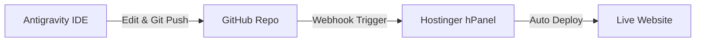

# Setting Up Hostinger Auto-Deployment with Antigravity

This guide explains how to host **maisonBenAliWebSite** on Hostinger and continuously edit and push updates directly from **Antigravity**.

---

## 🚀 Workflow Overview



Every time you edit your website in Antigravity and push changes (`git push`), Hostinger will automatically pull the updates and update your live website within seconds.

---

## Step 1: Initialize Git Local Repository

Once Git installation completes on your PC:

```bash
git init
git add .
git commit -m "Initial website commit"
```

---

## Step 2: Create a GitHub Repository

1. Open [GitHub New Repository](https://github.com/new).
2. Name the repository: `maisonBenAliWebSite`.
3. Choose **Public** or **Private**.
4. Click **Create repository**.
5. Copy the repository URL (e.g. `https://github.com/YOUR_USERNAME/maisonBenAliWebSite.git`).
6. Run these commands in Antigravity to connect your local site to GitHub:
   ```bash
   git remote add origin https://github.com/YOUR_USERNAME/maisonBenAliWebSite.git
   git branch -M main
   git push -u origin main
   ```

---

## Step 3: Connect GitHub to Hostinger (hPanel)

1. Log into your [Hostinger hPanel](https://hpanel.hostinger.com/).
2. Go to **Websites** and click **Manage** next to your domain.
3. On the left menu, go to **Advanced** ➔ **Git**.
4. Fill in the repository details:
   - **Repository**: `https://github.com/YOUR_USERNAME/maisonBenAliWebSite.git`
   - **Branch**: `main`
5. Click **Create**.

---

## Step 4: Enable Automatic Deployment (Webhook)

1. In Hostinger under your newly added Git repository, copy the **Webhook URL**.
2. Go back to your GitHub Repository ➔ **Settings** ➔ **Webhooks** ➔ **Add webhook**.
3. Paste the Hostinger **Webhook URL** into the **Payload URL** field.
4. Set **Content type** to `application/json`.
5. Click **Add webhook**.

---

## ⚡ How to Edit & Push from Antigravity

Whenever you want to modify your website:

1. **Modify with Antigravity**:
   Ask Antigravity: *"Change the title on index.html to X"* or edit files directly.
2. **Push to Hostinger**:
   Ask Antigravity: *"Push my changes to Hostinger"*
   *(or run `git commit -am "Updated website content" && git push` in terminal)*.

Your live website on Hostinger will update automatically!
