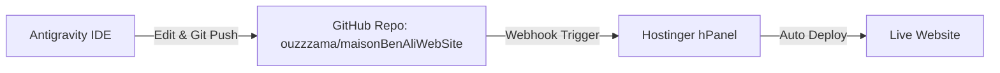

# Setting Up Hostinger Auto-Deployment with Antigravity

This guide explains how to host **maisonBenAliWebSite** on Hostinger and continuously edit and push updates directly from **Antigravity**.

---

## 🚀 Workflow Overview



Every time you edit your website in Antigravity and push changes (`git push`), Hostinger will automatically pull the updates and update your live website within seconds.

---

## Step 1: Linked GitHub Repository

Your GitHub Repository:
**`https://github.com/ouzzzama/maisonBenAliWebSite.git`**

Local repository commands (already configured):
```bash
git remote set-url origin https://github.com/ouzzzama/maisonBenAliWebSite.git
git push -u origin main
```

---

## Step 2: Connect GitHub to Hostinger (hPanel)

1. Log into your [Hostinger hPanel](https://hpanel.hostinger.com/).
2. Go to **Websites** and click **Manage** next to your domain.
3. On the left menu, go to **Advanced** ➔ **Git**.
4. Fill in the repository details:
   - **Repository**: `https://github.com/ouzzzama/maisonBenAliWebSite.git`
   - **Branch**: `main`
5. Click **Create**.

---

## Step 3: Enable Automatic Deployment (Webhook)

1. In Hostinger under your newly added Git repository, copy the **Webhook URL**.
2. Go to your GitHub Repository: [https://github.com/ouzzzama/maisonBenAliWebSite/settings/hooks](https://github.com/ouzzzama/maisonBenAliWebSite/settings/hooks)
3. Click **Add webhook**.
4. Paste the Hostinger **Webhook URL** into the **Payload URL** field.
5. Set **Content type** to `application/json`.
6. Click **Add webhook**.

---

## ⚡ How to Edit & Push from Antigravity

Whenever you want to modify your website:

1. **Modify with Antigravity**:
   Ask Antigravity: *"Change X on index.html"* or edit files directly.
2. **Push to Hostinger**:
   Ask Antigravity: *"Push my changes to Hostinger"*
   *(or run `git commit -am "Updated website content" && git push` in terminal)*.

Your live website on Hostinger will update automatically!
